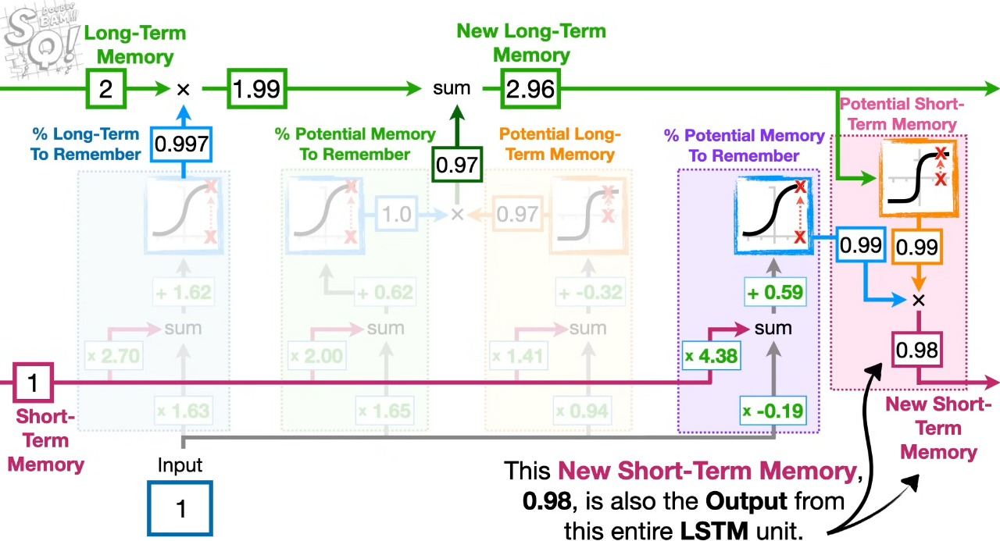

# LSTM (Long Short-Term Memory) Neural Networks

## Image Components Breakdown

The LSTM architecture shown in the image above consists of:

### Gate Structure
- **1st cell:** Forget Gate - Determines what information to discard
- **2nd & 3rd cells:** Input Gate - Controls what new information to store
- **4th & 5th cells:** Output Gate - Controls what information to output

## Why LSTM instead of RNN?

* **RNNs forget long-term info** (they suffer from vanishing gradient problem or gradient exploding problem)
* **LSTM remembers longer sequences** using special gates (input, forget, output)
* **Better performance** on tasks like text, speech, time-series

## Activation Functions in LSTM

### 1. Sigmoid Function (σ)
- **Formula:** σ(x) = 1 / (1 + e^(-x))
- **Output range:** 0 to 1

### 2. Tanh Function (Hyperbolic Tangent)
- **Full form:** Hyperbolic Tangent
- **Formula:** tanh(x) = (e^x - e^(-x)) / (e^x + e^(-x))
- **Output range:** -1 to 1

## Memory Types in LSTM

### 1. Short-Term Memory (Hidden State h)
- Updated at every time step
- Passes through weights and activation functions
- Used to produce outputs and carry recent information

### 2. Long-Term Memory (Cell State C)
- Designed to carry information across many time steps
- Flows through the network with minimal changes
- Not multiplied by weights during flow — it's only modified by gates:
    - **Forget Gate:** decides what to remove
    - **Input Gate:** decides what new info to add

### Why this helps?
Since the cell state doesn't pass through repeated weight multiplications, it avoids vanishing/exploding gradients.
That's why LSTM is better than standard RNNs for learning long-term dependencies.

## LSTM Components

LSTM consists of:

### Forget Gate
- Determines how much of the previous long-term memory should be retained based on the current input
- Uses the current input and the short-term memory (hidden state) from the previous cell
- Uses the sigmoid activation function
- Based on the current input, it determines how much of the long-term memory (in percentage) should be retained
- This percentage is then multiplied with the previous cell's long-term memory

### Input Gate
- Responsible for adding new information to the Long-Term Memory, after the Forget Gate has done its job
- Has two parts:
    1. **Determining the potential long-term memory**
         - This is the new memory from the current input that can be added to the long-term memory
         - Uses the tanh activation function
    2. **Calculating the percentage of the potential long-term memory**
         - Decides how much of this new memory should actually be added
         - Uses the sigmoid activation function
- We multiply Part 1 and Part 2 (info × quantity)
- The result is then added to the current long-term memory (cell state C), producing the updated long-term memory

### Output Gate
- Responsible for determining the new short-term memory based on the updated long-term memory
- Has two parts:
    1. **Determining the potential short-term memory**
         - This is the new memory that can become the next short-term memory, using the updated long-term memory
         - Uses the tanh activation function
    2. **Calculating the amount of potential short-term memory**
         - This decides how much of the potential short-term memory should be used
         - Uses the current input and the sigmoid activation function
- We multiply Part 1 and Part 2 (new info × quantity)
- The result becomes the next short-term memory

