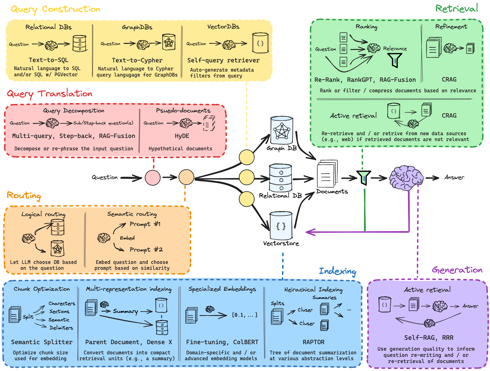

# Retrieval-Augmented Generation (RAG)

A comprehensive guide to understanding and implementing RAG systems.

## Table of Contents
- [Introduction to Indexing](#introduction-to-indexing)
- [Retrieval Process](#retrieval-process)
- [Generation Process](#generation-process)
- [RAG Use Case](#rag-use-case)
- [Query Translation](#query-translation)
    - [Multiple Query](#multiple-query)
    - [HyDE](#hyde)
    - [Comparison of Query Translation Techniques](#comparison-of-query-translation-techniques)
- [Routing in RAG](#routing-in-rag)
    - [Logical vs Semantic Routing](#logical-vs-semantic-routing)
- [Query Construction](#query-construction)
- [Indexing Techniques](#indexing-techniques)
- [Retrieval Techniques](#retrieval-techniques)
- [Generation Techniques](#generation-techniques)
- [End-to-End RAG Pipeline](#end-to-end-rag-pipeline)
- [Embedding Models](#embedding-models)
- [Vector Databases](#vector-databases)
- [Chunking Methods](#chunking-methods)
- [Implementation Notes](#implementation-notes)



## Introduction to Indexing

This is the area where we perform operations to index the given documents. When a query is given, we find the most info (relevant index) from our documents. This results in the retrieval of relevant information from the document based on the query.

### How are we going to do that?
First, we need to convert the documents into numerical form so that we can easily index them.

### But how do we convert them?
Google developed a method called Bag of Words (BoW). This involves converting documents into numerical form using a vector space. But BoW focuses only on the frequency of words, not the order or sequence. It also results in sparse values.

#### Example of BoW:
Suppose we have two sentences:

"I love dogs"

"I love cats"

Vocabulary: ["I", "love", "dogs", "cats"]
Vectors:

"I love dogs" → [1, 1, 1, 0]

"I love cats" → [1, 1, 0, 1]

As you can see, it counts word occurrences, but no context or meaning is captured.

So, we moved on to embedding techniques. These methods:

- Restrict vocabulary size
- Reduce sparsity
- Capture contextual understanding

Examples include Continuous Bag of Words (CBOW) and Skip-gram.

#### Example of Embedding:
Sentence: "I love dogs"
After embedding, it may look like:
→ [0.23, -0.51, 0.78, ...] (dense vector capturing meaning)

These embeddings preserve semantics—so similar sentences have similar vectors.

### Summary of the workflow:
Documents are given as input for indexing. These documents are split based on the number of tokens the embedding technique can handle (like 512, 8000 tokens, etc.).

After splitting, the parts are embedded (converted/compressed to numerical vector format) where each vector carries sentence-level information.

The query also goes through the same process.

After embedding the query, matching techniques (e.g., cosine similarity, dot product) are used to find the closest vector(s) from the document vectors to the query vector.

This gives us the relevant information from the document based on the given query.

## Retrieval Process

### What do we need?
We want to retrieve information related to the question from the document.

### Chunks
Documents are split into smaller parts called chunks.
For example:

doc1 → split into doc1.1, doc1.2 (based on length and embedding model token limit).

These parts: doc1.1, doc1.2 are called chunks.

### How is it done?
Chunks are converted into vectors using embedding techniques.

These vectors are indexed during the indexing process.

Now, imagine these vectors are spread out in a big space (vector space).

If two chunks have similar meaning, their vectors will be close to each other in this space.

### Retrieving Relevant Info:
The input query is also converted into a vector using the same embedding model.

This query vector is placed into the same vector space as the document vectors.

We now search for document vectors that are closest to the query vector. We use search algorithms like brute force, KNN, etc.

These nearby vectors are considered relevant information.

We can even control how many nearby vectors we want to retrieve.

## Generation Process

### 🧠 Context Window
Context window = The amount of text (tokens) an LLM can read at once.
Think of it like a memory span:

- If the context window is 4,000 tokens, the model can "see" and use only the last 4,000 tokens.
- If the text goes beyond that, older tokens are forgotten.

### ❓What do we need?
We want to generate an output based on the retrieved info, with respect to the user's query.

### ⚙ How do we do that?
Retrieved info is in vector form only during the search step.

Once relevant chunks are found, those vectors are converted back to original text.

These text chunks are fed into the LLM's context window, along with:

- The user's query
- An optional prompt/instruction

The LLM (chat model) processes this combined input:
→ [ Retrieved Info (text) + Query + Optional Prompt ]

Then it generates the final answer using that information.

### 📥 What goes into the LLM's context window?
🟢 1. Retrieved Chunks (Text)
🟢 2. Original User Query
🟢 3. An extra Prompt/Instruction (optional but useful)

## RAG Use Case

### 🧠 Use Case:
A company wants a chatbot that can answer questions using its internal HR policy documents (not available on the public internet).

### 👣 Step-by-Step RAG Flow
🔹 **Step 1: Document Preparation & Indexing**
Docs:

hr_policy.pdf → Split into chunks like:

Chunk 1: "Employees can take up to 15 days of paid leave annually."

Chunk 2: "Remote work is allowed for a maximum of 3 days a week."

Embedding:

Each chunk is converted into a vector using an embedding model like OpenAI, BERT, etc.

Indexing:

These vectors are stored in a vector database (e.g., FAISS).

🔹 **Step 2: User Query**
👤 User asks:

"How many days of paid leave can I take in a year?"

🔹 **Step 3: Retrieval**
Query is also converted to a vector.

This vector is searched in the vector space to find similar chunks.

Retrieved chunk:
→ "Employees can take up to 15 days of paid leave annually."

🔹 **Step 4: Generation**
The system now forms the final input to LLM like:

```
Answer the question using the context below:

Context:
Employees can take up to 15 days of paid leave annually.

Question:
How many days of paid leave can I take in a year?
```

LLM Output:

"You are allowed to take up to 15 days of paid leave each year."

## Query Translation

### Why do we need Query Translation?

The information retrieved is based on the user's initial query, but sometimes the query might be inappropriate or too vague to extract the right information from the vector space.

To overcome this, we need Query Translation.

Query Translation means changing the user's input query to improve the retrieval process, ensuring the best information is fetched from the vector space. This can be done using various techniques like:

- Multi-Query
- RAG Fusion
- Decomposition
- Step Back
- Hypothetical Document Embedding (HyDE)

## Multiple Query

Generate sub-queries based on the main user query.
(e.g., Break the original query into more specific questions.)

### Example:

Main Query: "What are the benefits of working remotely?"

Sub-query 1: "What are the health benefits of working remotely?"

Sub-query 2: "How does working remotely affect work-life balance?"

Sub-query 3: "How does working remotely impact employee productivity?"

Or generate a broader, well-defined query from the original user query.
(e.g., Ask a higher-level question to cover a wider scope.)

### Example:

Original Query: "Who are you?"

Broader Queries:

"Where do you live?"

"What job do you currently have?"

"What's your main work in life?"

### Embedding:

Each of these generated queries (both sub-queries and broader queries) is embedded into vectors.

### Search:

Search the vector space using all the query vectors (both sub-queries and the main query).

### Retrieval:

Retrieve the relevant documents for each query.

### Final Input to LLM:

Feed all the retrieved documents along with the user's initial query into the LLM's context window.

## HyDE

### 🔶 What is HyDE?
HyDE = Hypothetical Document Embeddings
It means:
Instead of retrieving documents directly using the user query,
you first generate a fake (hypothetical) answer, then use that answer to search the vector database.

### 🔄 How it works:
User Query:
"What are the benefits of remote work?"

LLM generates a fake answer:
"Remote work improves productivity, work-life balance, and reduces commute time."
→ This is not the final answer — it's just a guess!

Embed this generated answer (instead of the original query).

Search the vector database using this embedding.

Retrieve real documents that match this hypothetical answer.

Feed retrieved docs + user query to LLM for the final answer.

### 🎯 Why use HyDE?
Sometimes, user queries are short or vague.

A generated answer has richer context and keywords.

It improves the chances of finding relevant documents.

## Comparison of Query Translation Techniques

**Multi Query**
- Generate Subquery / Broader Query from the user query.
- Search related / nearest info in the vector space for each query.
- Insert those result docs into the LLM's context window. May the retrieved docs will contain duplicates also.
- Focuses more on the variety of the queries that can be generated.

**RAG Fusion**
- Generate multiple queries like the main query (user query).
- Find the related vectors in the vector space for each query.
- Deduplicate the retrieved docs, pick the top-k docs for each query based on the frequencies.
- Insert those top-k docs into the LLM's context window.
- Focuses more on the quality of the queries generated and also focuses on the quality of docs being retrieved.

**Step Back**
- A broader version of the main query being generated unlike Multi-query. All the broader queries are generated in such a way that it goes step by step.
- Find the related docs in the vector space for the query.
- Feed that into the context window of the LLM.

**Decomposition**
- A subquery version of the main query being generated unlike Multi-query. All the subqueries are generated in such a way that it goes step by step.
- Find the related docs in the vector space for the query.
- Feed that into the context window of the LLM.

**HyDE (Hypothetical Document Embedding)**
- Instead of retrieving documents directly using the user query, you first generate a fake (hypothetical) answer for that user query using the model, then use that answer to search the vector database.
- Using the model-generated output, retrieve the vectors which are related to that answer in the vector space.
- Retrieve those answers and feed those into the context window of the LLM.

## Routing in RAG

### 🔁 What is Routing in RAG?
Routing is the process of deciding how to handle a user's query before performing retrieval.

In Retrieval-Augmented Generation (RAG), we usually retrieve external info from a knowledge base to help a large language model (LLM) answer a question. But not all queries need the same strategy, source, or type of retrieval.

So, routing answers this question:

➡ "Which retrieval path should we take for this query?"

### 🎯 Why Routing is Important
Imagine you have:

- Multiple document databases (e.g., Medical docs, Financial reports, FAQs).
- Multiple RAG variants (e.g., HyDE, Fusion, Decomposition).
- Limited context window space.

You don't want to blindly search everywhere for every query. That wastes time, cost, and accuracy.

So, Routing helps:

- Save resources.
- Improve relevance.
- Choose the best retrieval logic for different types of queries.

### 🧠 How Routing Works (Components)
1. **Query Understanding**
     Analyze the query to understand:
     - Its topic/domain (e.g., finance, healthcare).
     - Its intent (e.g., informative, summarization, chit-chat).
     - Its complexity.

2. **Decision Logic (Router Module)**
     Based on the analysis, choose:
     - Which retriever to use (e.g., search financial DB only).
     - Which retrieval strategy (e.g., HyDE vs. Multi-query).
     - Whether retrieval is needed at all (some queries can be answered directly by the LLM).

3. **Execution Path**
     The chosen retrieval method is triggered → retrieved docs + query → passed into the LLM for final answer generation.

### 🔧 Techniques for Implementing Routing
**Rule-based Routing**
- Manually define rules.
- E.g., "If query contains 'revenue', use Financial DB."

**Embedding-based Routing**
- Embed the query and match it to predefined vector clusters (e.g., domain embeddings).
- Helps detect intent/domain automatically.

**Classifier-based Routing**
- Train an ML model or use LLM to classify query type.
- Output → which retriever or method to use.

### 💡 Real-Life Examples
**Example 1:**
- Query: "What are the symptoms of diabetes?"
- Router detects: Medical intent
- Route to: Medical docs → Use regular retrieval → Generate answer with LLM

**Example 2:**
- Query: "What's 2+2?"
- Router detects: Simple math → LLM can answer directly
- Route to: Skip retrieval → Let LLM generate answer

**Example 3:**
- Query: "Summarize the Q4 sales report and explain key trends."
- Router detects: Business report + summarization
- Route to: Internal business docs → Use HyDE or Decomposition → Feed to LLM

## Logical vs Semantic Routing

### 🔹 Logical Routing
**Definition:**
Routing based on predefined rules or patterns in the query.

**How it works:**
You manually set rules or conditions like:

- If query contains specific keywords → route to a specific data source.
- If query is a math question → send it directly to the LLM, skip retrieval.
- If query is longer than 50 words → use summarization strategy.

**Example Rules:**
- "symptoms" → search Medical DB
- "invoice" → search Financial DB
- "define" or "what is" → use normal retrieval

**Pros:**
- Simple to implement
- Fast decision-making

**Cons:**
- Not flexible
- Can fail for ambiguous or complex queries

### 🔹 Semantic Routing
**Definition:**
Routing based on the meaning of the query using embeddings or classification models.

**How it works:**
- Convert query into a vector representation (embedding)
- Match it against domain-specific vectors or run through a semantic classifier
- Route based on similarity or predicted intent

**Example:**
- Query embedding is closest to "Legal" domain → route to Legal DB
- Semantic classifier detects summarization intent → use Decomposition RAG

**Pros:**
- More flexible
- Handles complex, vague, or long queries better

**Cons:**
- Requires embedding models or training
- Slightly higher compute cost

## Query Construction

### 🔹 What is Query Construction?
Query Construction means:

"Converting a user's natural language question into a searchable query that a database can understand."

It's the bridge between human language and machine-readable formats like SQL, Cypher, or vector search queries.

### ✅ 1. Relational DBs – Text to SQL
**🔸 What is it?**
Relational databases (like MySQL, PostgreSQL) store data in tables (rows and columns).
To get info, we need to write SQL queries.

**🔸 In Query Construction:**
We use LLMs to translate natural language → SQL.

**🔸 Example:**
User Query:
"Show me the names of customers who made a purchase over $1000."

Constructed SQL Query:
```sql
SELECT name FROM customers WHERE purchase_amount > 1000;
```
This SQL is then run on the relational DB to fetch relevant rows.

**🔸 Tools:**
- Text2SQL models (e.g., from OpenAI, T5, or specialized models)
- LangChain SQL agents

### ✅ 2. Graph DBs – Text to Cypher
**🔸 What is it?**
Graph databases (like Neo4j) store data as nodes and relationships.
To query them, we use Cypher language (like SQL for graphs).

**🔸 In Query Construction:**
Convert the user's question into a Cypher query.

**🔸 Example:**
User Query:
"Find all friends of John who work at Google."

Constructed Cypher Query:
```cypher
MATCH (p:Person {name: 'John'})-[:FRIEND]->(f:Person)-[:WORKS_AT]->(c:Company {name: 'Google'})
RETURN f.name;
```
This is run on the graph DB to fetch results.

### ✅ 3. Vector DBs – Self-Query Retriever
**🔸 What is it?**
Vector DBs store text embeddings for similarity search (e.g., ChromaDB, FAISS, Pinecone).

In this case, we don't use SQL or Cypher.
Instead, we construct a structured search filter using the Self-Query Retriever.

**🔸 Self-Query Retriever:**
It uses an LLM to analyze the user's question and extract:
- The search intent
- The keywords
- The metadata filters (e.g., date, category)

Then it builds a search query for the vector DB.

**🔸 Example:**
User Query:
"Find research papers on climate change published after 2021."

Constructed Filtered Vector Query:
```json
{
    "query": "climate change research papers",
    "filter": {
        "date": { "$gt": "2021-01-01" }
    }
}
```
This helps narrow down relevant vectors more precisely.

## Indexing Techniques

### 🔹 What is Indexing (in RAG)?
Indexing = The process of converting text data into vector form and storing it in a searchable structure (like a Vector DB) to enable fast retrieval later.

**Steps:**
1. Chunk the documents (split large text into smaller parts).
2. Embed each chunk using an embedding model.
3. Store those embeddings in a vector store (e.g., FAISS, Chroma, Pinecone).

### 🔹 What is Chunk Optimization? (Semantic Splitter)
**Problem:**
Poor chunking (e.g., cutting in the middle of a sentence) can lead to loss of meaning and bad retrieval.

**🔸 Semantic Splitter:**
Instead of using fixed-size chunks (e.g., 100 tokens), we use semantic-aware splitting to break the document at logical boundaries (like paragraphs, thoughts, topics).

✅ This preserves context and improves retrieval quality.

**📌 Tools:** Recursive Character Splitter, NLTK-based sentence splitting, text-splitter in LangChain, etc.

### 🔹 What is Multi-Representation Indexing?
It means creating multiple kinds of representations for the same document to improve recall.

**🔸 1. Parent-Child Indexing:**
- Child Chunks: Small pieces used for searching.
- Parent Docs: Larger docs that give more context.

✅ You search using small chunks (precise), but return the full parent doc (for context).
- Only the child chunks are embedded and stored in the vector store (because they're small and searchable).
- Retrieve relevant child chunks using the user query.
- Then map the retrieved child chunk back to its parent document.
- The parent document is what gets sent to the LLM.

**🔸 2. Dense X:**
Generate multiple embeddings per chunk, each representing different aspects or perspectives.

✅ Helps in capturing multiple meanings or angles of a single piece of text.

### 🔹 What is Specialized Embeddings?
**Problem:**
Generic embeddings (e.g., OpenAI, BERT) may not understand your domain-specific language well.

**🔸 1. Fine-Tuning:**
Train the embedding model on your own dataset to better capture your vocabulary, tone, or structure.

**🔸 2. ColBERT (Late Interaction):**
ColBERT (Columnar BERT) generates embeddings at token level, not just whole-sentence level.

✅ During search, it compares query tokens with doc tokens using fine-grained matching.

✅ Better for passage-level or phrase-level search.

### 🔹 What is Hierarchical Indexing? (e.g., RAG + RAPTOR)
Instead of flat chunking, use a hierarchy of chunks:
- Chunk documents at multiple levels: sentence → paragraph → section.
- Create embeddings for each level.
- Use a top-down approach in retrieval.

**🔸 RAPTOR (Retrieval-Augmented Generation with Passage Tree Organization):**
RAPTOR builds a tree of passages (chunk hierarchy), retrieves high-level passages first, then drills down to relevant sub-sections.

✅ Improves relevance, avoids overload in the context window.

### 🧠 Summary Table:
| Concept | Description |
|---------|-------------|
| Indexing | Converting docs into vector form for fast retrieval |
| Chunk Optimization | Smartly splitting docs using semantic understanding |
| Multi-Representation Indexing | Store chunks + parent doc / multiple views (Dense X) |
| Specialized Embeddings | Custom/fine-tuned embeddings or token-level matching (ColBERT) |
| Hierarchical Indexing | Tree-structured multi-level chunks (RAPTOR) |

## Retrieval Techniques

Here's a detailed breakdown of Retrieval and its key techniques like Ranking, Refinement, and Active Retrieval:

### 🔹 1. What is Retrieval?
Retrieval = The process of finding relevant chunks/documents from a vector database based on the user query.

🧠 You: "What is RAG?"
📦 Vector DB: [chunk1, chunk2, chunk3, ...]
🔍 Retrieval finds chunks semantically similar to the query.

### 🔹 2. What is Ranking (in Retrieval)?
Ranking = Sorting the retrieved documents by relevance before passing to the LLM.

**📍 Techniques:**
- **Re-Rankers (e.g., ColBERT, Cohere Reranker):**
    After initial retrieval, rerank the results using a small model trained for ranking.

- **RankGPT:**
    Uses GPT-based models to evaluate and rank retrieved docs by how well they answer the query.

- **RAG-Fusion:**
    Generates multiple queries, retrieves results for each, and ranks documents based on frequency or combined relevance.
    Return the top K documents using the frequency of the document being retrieved.

➡ Goal: Pick the top-k most relevant documents for the LLM.

### 🔹 3. What is Refinement (in Retrieval)?
Refinement = Improve the quality of retrieved documents using multiple steps.

🧠 Example: CRAG (Chain-of-Retrieval-Augmented Generation)
Iteratively refine the retrieval based on model feedback.

Step 1: Retrieve docs → Ask model → If answer is uncertain, re-retrieve or expand search.

📌 Refinement = "Let's make sure we have the best info before answering."

### 🔹 4. What is Active Retrieval?
Active Retrieval = Make retrieval dynamic based on the LLM's intermediate reasoning.

🧠 LLM can say:
"This info isn't enough — I need more about X."
Then it actively requests new retrieval with a refined or follow-up query.

➡ Similar to how humans ask clarifying questions before answering.

### Relevance Measurement Methods:
- **Cosine Similarity:**
    Measures the angle between the query and document vectors in the vector space. A smaller angle means higher similarity.

- **Dot Product:**
    If you use embedding vectors, a higher dot product indicates greater similarity.

## Generation Techniques

### What is Generation?
In the context of RAG (Retrieval-Augmented Generation), generation refers to the process where a language model (LLM) produces an output (answer or text) based on the retrieved information and the input query provided by the user.

### What is Active Retrieval in the context of Generation?
Active Retrieval is an approach used in the RAG framework to improve the retrieval process and make it more dynamic during the generation phase. It involves actively interacting with the retrieval process during the generation step, often by continuously improving the search based on feedback or intermediate results.

In Active Retrieval, instead of just retrieving once and generating, the system may re-evaluate the query, refine it, or perform additional retrieval rounds to ensure the most relevant information is being fed to the model. It is an iterative process that ensures the generated response is more accurate and contextually sound.

### ✅ Self-RAG
Query → Retrieve → Evaluate → Rephrase → Retrieve (loop continues)

The model itself decides if the retrieved docs are good enough.

If not satisfied, it rephrases the query and tries again.

Continues until the model feels the context is strong enough for generation.

🔁 Multiple refinement cycles possible.

### ✅ RRR (Retrieval → Refinement → Retrieval)
Query → Retrieve → Rephrase once → Retrieve again → Generate

The query is rephrased only once, usually by the model or a separate module.

No further iterations — it's a one-shot refinement before final retrieval.

📌 Faster, less computational, but may be less adaptive than Self-RAG.

## End-to-End RAG Pipeline

### ✅ 1. Query Translation
Transform the user query into better queries (sub-queries, broader queries, etc.)
→ Helps improve retrieval quality

### ✅ 2. Query Routing
Decide where to send the query (vector DB, relational DB, graph DB, etc.)
→ Based on query type or intent

### ✅ 3. Query Construction
Convert query to the appropriate form for the selected DB

- Text → SQL (Relational DB)
- Text → Cypher (Graph DB)
- Text → Embedding (Vector DB)

### ✅ 4. Indexing
Preprocessing step for storing and organizing data

- Chunking
- Embedding
- Optimizations (e.g., multi-representation, semantic splitting)

### ✅ 5. Retrieval
Search the indexed data using the constructed query
→ Return most relevant chunks/docs

### ✅ 6. Generation
Feed retrieved docs + original query into LLM
→ Generate the final response

## Embedding Models

### Sentence-BERT (SBERT)
✅ Best for: Short texts, QA, semantic similarity

🔍 Embeds sentence meaning

🆓 Open-source

### OpenAI Embeddings (e.g., text-embedding-ada-002)
✅ Best for: General-purpose semantic search

🔥 Great accuracy + easy to use

💰 Paid

### HuggingFace Models (e.g., all-MiniLM-L6-v2)
✅ Best for: Free local embedding

🧠 Decent performance

🆓 Open-source

## Vector Databases

### 🔹 Famous Vector DBs

| Vector DB | Key Features | When to Use |
|-----------|-------------|------------|
| Pinecone | Fully managed, scalable, fast | For production apps with large-scale data |
| Chroma | Open-source, lightweight, simple API | For local/testing/dev use, quick prototypes |

## Chunking Methods

| Chunking Method | Description | When to Use |
|----------------|-------------|------------|
| Fixed-size | Splits by fixed #tokens or characters | Simple use-cases, consistent structure |
| Sentence-based | Splits on sentence boundaries | When sentence meaning must be preserved |
| Semantic Splitter | Splits based on meaning (e.g., LLM-aware chunking) | For high retrieval accuracy & context matching |
| Overlap Chunking | Overlaps chunks slightly to preserve context | When context continuity is important |

## Implementation Notes

For indexing purposes we will be storing the vector in a vector database such as ChromaDB, PineCone etc.

In the query Translation multiple queries can be generated using any other text generation model like BART or GPT-3 etc.

Example:
- Example prompt for sub-query generation: "Given the question 'What are the health benefits of working remotely?', generate 5 specific sub-queries."
- Example prompt for broader query generation: "Given the question 'What are the health benefits of working remotely?', generate 3 broader, general questions."