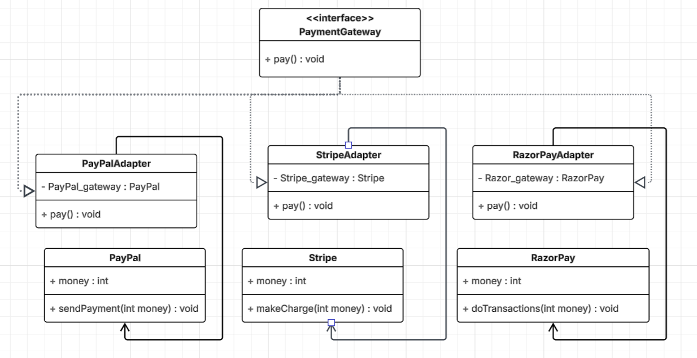

# Adapter Design Pattern Practice

This exercise demonstrates the **Adapter** design pattern by integrating multiple payment services into a unified interface for an e-commerce application.

## Problem Statement

You are building an e-commerce app that supports multiple payment services:

- **Service A:** `Paypal` with a method `sendPayment(double amount)`
- **Service B:** `Stripe` with a method `makeCharge(double value)`
- **Service C:** `Razorpay` with a method `doTransaction(int money)`

## Task

- Define a common interface called `PaymentGateway` with a method `pay(double amount)`.
- Create adapter classes for each payment service to implement the `PaymentGateway` interface.

## UML Diagram

---

**Goal:**  
Unify different payment service APIs under a single interface using the Adapter pattern.
